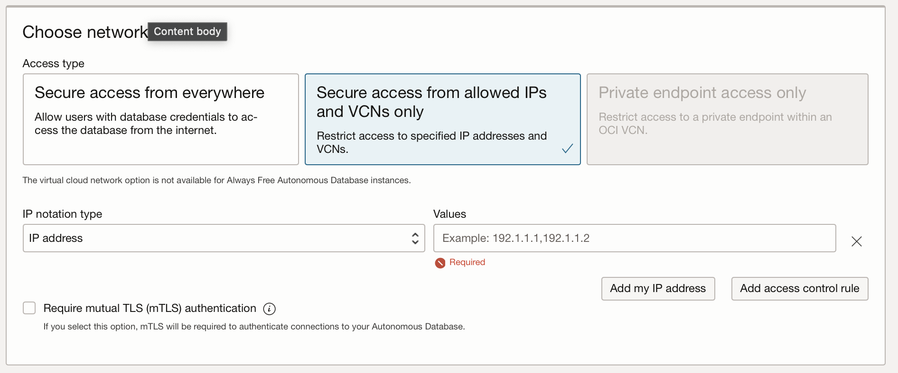
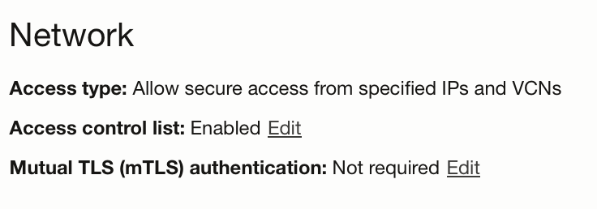
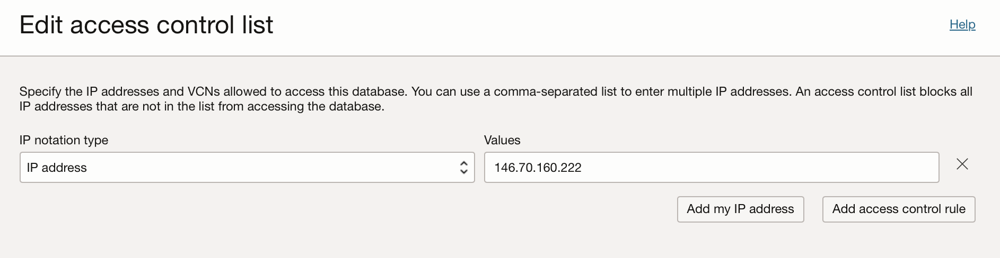

# Add a storage layer to our app

### Pre requisites: 
* Have an autonomous free database in your Oracle Cloud. This is a lab already covered in databases class.
* oracledb requirement
* Create Autonomous database with mTLS disabled
* Whitelist your IP Address
* pip install oracledb
https://docs.oracle.com/en/cloud/paas/autonomous-database/serverless/adbsb/connecting-python-tls.html#GUID-64FC3F00-42EF-45FC-9306-DD0A61186B09

## Steps:

### Step 1: Create an autonomous database with mTLS disabled
1. Create an autonomous database as you already know but make sure to select during creation:
  1. 'Secure access from allowed IPs and VCNs only'
  1. Unmark 'Require mutual TLS'
  1. Click 'Add my IP Address'


### Step 2: Test Connectivity

1. Install `oracledb` python library `pip install oracledb`
1. Create a python file anywhere in your laptop with the following contents
    ```python
import oracledb

un = '<YOUR_USERNAME>'
cs = '<YOUR_CONNECTION_STRING>'
pw = '<YOUR_PASSWORD>'

with oracledb.connect(user=un, password=pw, dsn=cs) as connection:
    with connection.cursor() as cursor:
        sql = """select sysdate from dual"""
        for r in cursor.execute(sql):
            print(r)
```
1. Run that file. If everything is fine you should see current datetime printed.

### Step 3: Open your database and create the required tables
1. ssh to your database
1. Create the table
```sql
CREATE TABLE WatchedEpisodes (
    id NUMBER GENERATED BY DEFAULT AS IDENTITY MINVALUE 1 START WITH 1 PRIMARY KEY,
    user_id NUMBER NOT NULL,
    episode_id NUMBER NOT NULL,
    progress NUMBER NOT NULL
);
```

### Step 4: Interact with the database
1. Let's now create an endpoint to update the progress a user has made while watching an episode
```python
import oracledb

un = '<YOUR_USERNAME>'
cs = '<YOUR_CONNECTION_STRING>'
pw = '<YOUR_PASSWORD>'

def get_or_create_watched_episode(cursor, user_id, episode_id):
    watched_episode = None
    # Create the select sql query
    sql = f'select * from WatchedEpisodes WHERE user_id = {user_id} AND episode_id = {episode_id}'
    cursor.execute(sql)
    watched_episode = cursor.fetchone()

    # If it doesn't exist, create a new one
    if not watched_episode:
        new_id = None
        cursor.execute("INSERT INTO WatchedEpisodes VALUES (:user_id, :episode_id, :progress) RETURNING id INTO :new_id", [user_id, episode_id, 0, new_id])
        watched_episode = {'id': new_id.getvalue(), 'user_id': user_id, 'episode_id': episode_id, 'progress': 0}
                
    
    return watched_episode


...
@app.route('/continue-watching/update-progress/<user_id>/<episode_id>/<progress>')
def update_progress(user_id, episode_id, progress):
    with oracledb.connect(user=un, password=pw, dsn=cs) as connection:
        with connection.cursor() as cursor:
            # Configure the cursor to return rows as dictionaries
            columns = [col[0] for col in cursor.description]
            cursor.rowfactory = lambda *args: dict(zip(columns, args))
            # Get or create the watched episode record
            watched_episode = get_or_create_watched_episode(cursor, user_id, episode_id)
            
            cursor.execute("UPDATE WatchedEpisodes SET progress = :progress WHERE id = :id", [progress, watched_episode['id']])

            watched_episode['progress'] = progress

    # Return the json representation of the updated episode
    return jsonify(watched_episode)
```

### Step 5: If your connection stops working, update your IP Address
1. From the database dashboard Click 'Edit' next to 'Access control list: Enabled' row
1. Click Add my IP address again


