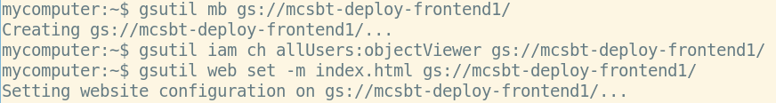
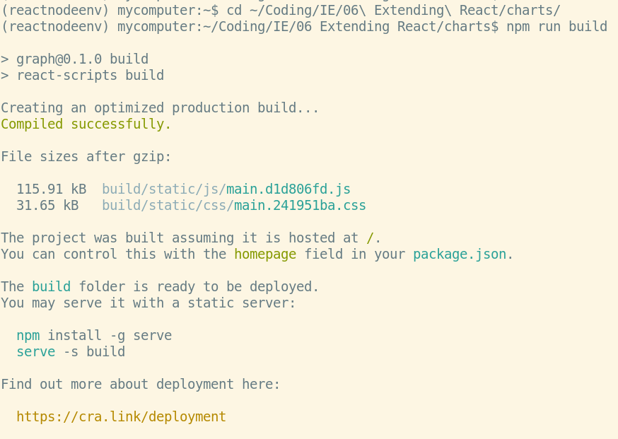
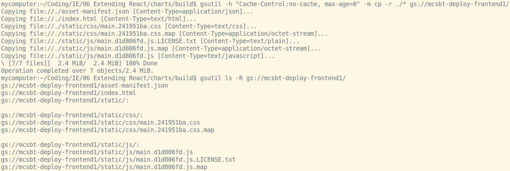
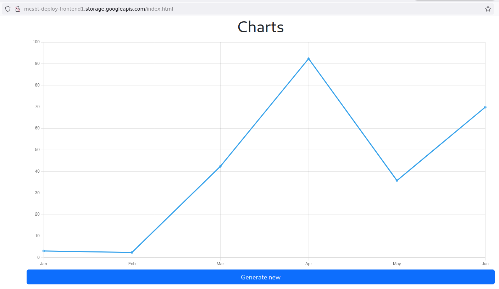
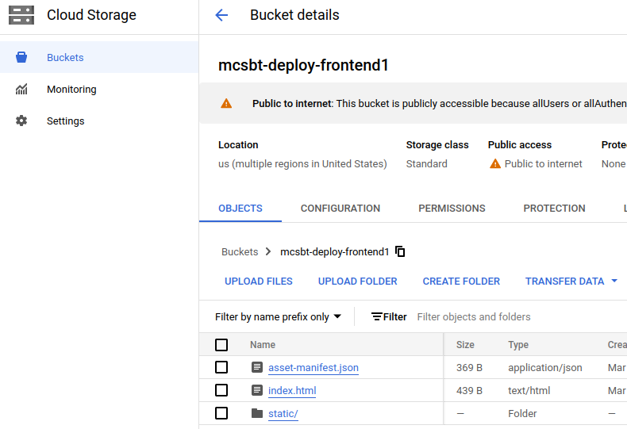
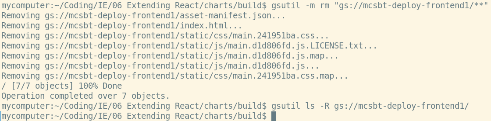

# Deploy a React Application to Google Cloud Storage

## Objective
Deploy a basic React application to Google Cloud Storage.

## Prerequisites
- [A Google Cloud account.](https://cloud.google.com)
- [Google Cloud SDK CLI installed.](https://cloud.google.com/cli?hl=en)
- A React application that is working and ready to be deployed

## Instructions

### Step 1: Prepare for Deployment

1. Ensure the Google Cloud SDK is installed and initialized: 
    ```shell
    gcloud init
    ```
    1. Make sure you log in with your `@student.ie.edu` account
    1. When prompted, create a new project named `mcsbt-integration` (if not exists yet)
1. Ensure you claim your student credits (look for Carlos' email)
1. Enable billing on your brand new project
    1. Navigate to `https://console.cloud.google.com/billing/projects`
    1. `My Projects` tab
    1. Find `mcsbt-integration` project, and click on `Change billing` entry under Actions section.
    1. Assign `Billing Account for Education` billing account.

### Step 2: Create a Google Cloud Storage Bucket
1. Create a new bucket (replace `YOUR_UNIQUE_BUCKET_NAME` with a unique bucket name):
    ```shell
    gsutil mb gs://YOUR_UNIQUE_BUCKET_NAME/
    ```
1. Make the bucket publicly accessible:
    ```shell
    gsutil iam ch allUsers:objectViewer gs://YOUR_UNIQUE_BUCKET_NAME
    ```

### Step 3: Configure the Bucket for Static Website Hosting
1. Set the main page to index.html (it will be generated in a later step by React):
    ```shell
    gsutil web set -m index.html gs://YOUR_UNIQUE_BUCKET_NAME
    ```

Example:


### Step 4: Build Your React Application
1. Remember to update any URLs in your code to point to the published backend, *NOT* localhost.
1. Open a terminal in your React app directory (where the `packages.json`file is located) and run:
    ```shell
    npm run build
    ```
    1. The process may take some time.
    1. This compiles the current version of your app into static files (index.html, CSS and JS) in the `build` directory.

Example:



### Step 5: Upload Your Build Directory to the Bucket
1. In the terminal, go to your React app's `build` directory.
1. Use gsutil to copy the files to your bucket:
    ```shell
    gsutil -h "Cache-Control:no-cache, max-age=0" -m cp -r ./* gs://YOUR_UNIQUE_BUCKET_NAME/
    ```
    1. The -m flag enables parallel uploads for faster transfer, and -r is for recursive copying to handle the directory structure.
1. You may check that all build files have been successfully uploaded by runnig:
    ```shell
    gsutil ls -R gs://YOUR_UNIQUE_BUCKET_NAME/
    ```

Example:



### Step 6: Access Your Deployed React App

1. Your React app will now be accessible via http://YOUR_UNIQUE_BUCKET_NAME.storage.googleapis.com/index.html
    1. Replace YOUR_UNIQUE_BUCKET_NAME with the name of your bucket.

Example:



### Step 7: Visualize your bucket from Google Cloud console

1. Navigate to cloud.google.com, type 'Cloud Storage' in the search bar and find your newly created bucket. See the assets inside.

Example:



### Step 8: Update the contents

1. If you need to upload a new version (remember that the built app does not get updated automatically when you continue developing):
    1. First delete all the contents in the bucket
    ```shell
    gsutil -m rm "gs://YOUR_UNIQUE_BUCKET_NAME/**"
    ```
    1. **Repeat this process from step 4.**
1. Make sure you clear your browser's cache before reloading.

Example:

